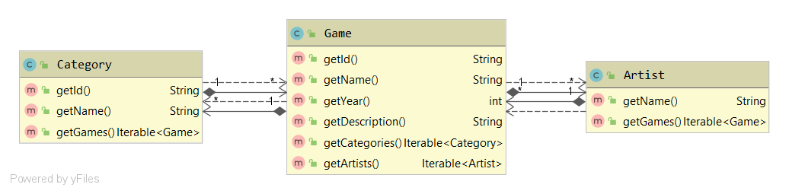
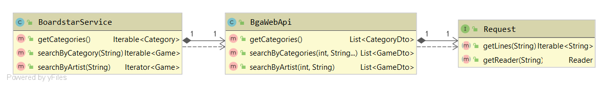

# Enunciado do Trabalho 1

**Data limite de entrega: 6 de Abril**

**Objectivos**: Prática com funções de primeira classe, expressões lambda,
funções de ordem superior, `Iterable<T>`

**NOTA**: 
1.  A solução entregue deve incluir todos os testes unitários necessários para
    validar o correcto funcionamento das funcionalidades pedidas. 
    **ATENÇÃO**: os testes devem verificar o correcto funcionamento do projeto mesmo sem
    ligação à internet.
2.  Este trabalho deve ser desenvolvido usando como base o projecto Gradle
    **boardstar** disponibilizado em https://github.com/isel-leic-mpd/boardstar.
    Copie toda a solução incluindo o ficheiro `.gitignore` para o repositório
    Github do grupo de MPD.
3.  Cada trabalho será desenvolvido num novo módulo dentro do projecto
    `boardstar`. Neste Trabalho 1 apenas trabalhará nos módulos `util` e
    `boardstar-lazy`.

Implemente a biblioteca `boardstar-lazy` que disponibiliza informação detalhada
sobre jogos de tabuleiro, suas categorias e os seus artistas. 
Os dados são obtidos a partir de uma API RESTful:
https://www.boardgameatlas.com/api/docs.
O modelo de domínio é formado pelas entidades: `Category`, `Game` e `Artist` e obedece à
especificação apresentada no diagrama de classes seguinte:

 

As classes do modelo de domínio estão implementadas no módulo **boardstar-lazy**.
Todas as relações entre as entidades de domínio são mantidas de forma **lazy**.

A instanciação e navegação dos objectos de domínio é feita por
`BoardstarService` que recorre à classe `BgaWebApi` para realizar os pedidos à
Web Api de Board Game Atlas.
 
 

## 1. **util** `LazyQueries`

O módulo **boardstar-lazy**  recorre a **boardstar-util** para executar tarefas
auxiliares tais como operações sobre sequências implementadas pela classe
`LazyQueries`.
Implemente em `LazyQueries` as seguintes operações e **todos os testes unitários
necessários à validação dos respectivos métodos**:

1. Baseando-se nas implementações dadas nas aulas, implemente os métodos
   `filter()`, `skip()`, `limit()`, `map()`, `generate()`, `iterate()`,
   `count()` e `toArray()`.
2. Baseando-se nas implementações dadas nas aulas, implemente os métodos
   `first()` e `max()`.
   Note que o tipo de retorno destes métodos deve ser `Optional<T>`.
3. `last(Iterable<T> src)` - retorna o último elemento da sequência `src`.
4. `takeWhile(Iterable<T> src, Predicate<T> pred)` - retorna uma nova sequência
  lazy com os primeiros elementos de `src` que verificam o predicado `pred`
5. `flatMap(Iterable<T> src, Function<T, Iterable<R>> mapper)` - retorna uma nova
  sequência lazy com o resultado das transformações de cada elemento de `src`
  pela função `mapper` num `Iterable<R>` combinados numa única sequência.
  Exemplo, dada uma sequência de palavras: “isel”, “super”, “ola”, então uma
  operação de `flatMap` sobre esta sequência com uma transformação de `String ->
  Iterable<char>`, deve resultar num `Iterable<char>` com: `‘i’, ‘s’, ‘e’, ‘l’,
  ‘s’, ‘u’, ‘p’, ‘e’, ‘r’, ‘o’, ‘l’, ‘a’`.


## 2. **boardstar-lazy** `BgaWebApi`

Implemente os métodos de `BgaWebApi` e **todos os testes unitários
necessários à validação dos respectivos métodos**.

**Note que todos os testes devem validar corretamente o projecto mesmo
na ausência de ligação  à internet.**

Para implementar as funcionalidade de `BgaWebApi` deve recorrer às seguintes rotas da Web API de Board Game Atlas:
  * https://www.boardgameatlas.com/api/docs/game/categories
  * https://www.boardgameatlas.com/api/docs/search

Os resultados da API RESTFul podem ser convertidos através da biblioteca Gson
para instâncias de classes pré-definidas (DTOs).


## 3. **boardstar -lazy** `BoardstarService`

Implemente os métodos de ` BoardstarService ` e **todos os testes unitários
necessários à validação dos seus métodos**.

As relações entre as entidades do modelo de domínio (`Category`, `Game` e `Artist`)
devem ser mantidas de forma **lazy**.
Os testes unitários devem validar o comportamento lazy, verificando que não são realizadas
operações de IO (e.g. HTTP ou acesso a ficheiros) enquanto não é obtido o `Iterator` resultante.
Por exemplo, a chamada a `getCategories()` não deve desencadear acesso de IO, tal como a chamada 
a `getGames()` sobre uma instância de `Category` também não deve fazer acesso IO até que os objectos 
`Iterator` sejam obtidos.

Note que alguns dos métodos de `BgaWebapi` recebem um segundo parâmetro
inteiro correspondente ao número da página.
Nestes casos o método correspondente de `BoardstarServive` deve retornar um iterável
que percorre os elementos de todas as páginas disponíveis até ser obtida uma
página sem elementos.
Para tal deve executar um encadeamento de operações semelhante ao seguinte:

```
iterate(…) ==> 1,2,3,.. 
           ==> map(invoke BgaWebApi) 
           ==> list 1, list 2, … 
           ==> takeWhile(list.size() != 0) 
           ==> flatMap(lst) 
           ==> map(dto -> model)
```

## 4. **util** `LazyQueries::cache`

Implemente em `LazyQueries` uma função utilitária `cache()` que pode ser
aplicada a qualquer sequência retornando uma nova sequência do mesmo tipo, e.g.
`games = cache(games)`.
A sequência resultante deve guardar em memória os elementos que vão sendo
obtidos por um iterador.
O método `next()` retorna sempre os elementos que já estejam guardados em
memória e só obtém um novo elemento caso este não esteja _cached_.
Exemplo de utilização do método `cache()` sobre uma sequência infinita:

```java
Random r = new Random();
Iterable<Integer> nrs = generate(() -> r.nextInt(100));
nrs = cache(nrs);
Object[] expected = toArray(limit(nrs, 10));
Object[] actual = toArray(limit(nrs, 10));
assertArrayEquals(expected, actual);
```

Verifique o correcto funcionamento desta função confirmando que não são feitos
novos pedidos HTTP quando uma sequência de jogos é percorridas mais que uma vez.
