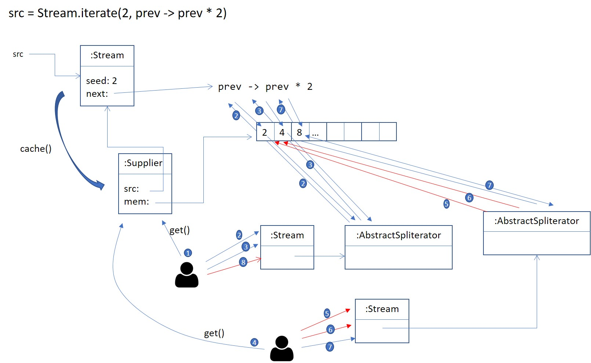

# Enunciado do Trabalho 2

**Objectivos**: Prática com `Stream<T>`, `Spliterator<T>` e o idioma internal
iteration.
<br>
**Data limite de entrega**: **4 de Maio de 2020**

**NOTA**: Implemente os testes unitários necessários para validar o
funcionamento das funcionalidades pedidas.

No âmbito do projecto **boardstar** pretende-se implementar o módulo 
`boardstar-streams` com objectivos semelhantes aos de `boardstar-lazy`,
mas substituindo a utilização de `Iterator<T>` por `Stream<T>`. 

## Parte 1

Copie do módulo `boardstar-lazy` para o módulo `boardstar-streams` todo o conteúdo
do sub-package `boardstar` incluindo entidades de domínio, serviços e DTOs.

No módulo `boardstar-streams` substitua a utilização de:
1. `Iterator<T>` por `Stream<T>`
2. `Iterable<T>` por `Supplier<Stream<T>>`
2. `LazyQueries` pelos métodos default de `Stream<T>`.

Implemente numa nova classe auxiliar `StreamUtils` o método 
`Supplier<Stream<T>> cache(Stream<T> src)`.
A sequência resultante do `cache()` deve:
1. guardar em memória os elementos que vão sendo obtidos da sequência fonte `src`.
2. retornar sempre os elementos que já estejam guardados em
memória e só obtém um novo elemento caso este não esteja _cached_.

Exemplo de utilização do método `cache()` sobre uma sequência infinita:

```java
Random r = new Random();
Stream<Integer> nrs = generate(() -> r.nextInt(100));
Supplier<Stream<Integer>> nrs = cache(nrs);
Object[] expected = nrs.get().limit(10).ToArray();
Object[] actual = nrs.get().limit(10).ToArray();
assertArrayEquals(expected, actual);
```

Note que os elementos das sequências resultantes de `cache()` podem ser obtidos alternadamente
entre sequências, tal como apresenta o exemplo de intercalação de 8 acções na imagem seguinte:

* 1 Obtém uma sequênca do `Supplier` retornado por `cache()`.
* 2 e 3 Lê os valores 2 e 4 da sequência resultante de 1. que não existiam em memória e
foram obtidos da sequência fonte (`src`) e adicionados em `mem`.
* 4 Obtém uma nova sequênca do `Supplier` retornado por `cache()`.
* 5 e 6 Lê os valores 2 e 4 da sequência resultante de 4. que já estavam em memória.
* 7 Lê o valor 8 da sequência resultante de 4. que não existia em memória e
foi obtido da sequência fonte (`src`) e adicionados em `mem`.
* 8 Lê o valor 8 da sequência resultante de 1. que já estavam em memória.

 

## Parte 2

Implemente em `StreamUtils` o método `Stream<T> interleave(Stream<T> src, Stream<T> other)`
que retorna uma nova sequência com os elementos de `src` e `other` intercalados entre si.
E.g. Dado `src = Stream.of("1", "2", "3")` e `other = Stream.of("a", "b", "c", "d", "e", "f")` então 
`res = interleave(src, other)` resultará numa sequência com os elementos 
`"1","a", "2, ""b", "3, ""c", "d", "e", "f"`.
A implementação deve ser _lazy_.

## Parte 3

Sem fazer novas implementações de `Spliterator` implemente as sequintes _queries_ à custa dos
métodos default de `Stream` e das operações auxiliares que implementou em `StreamUtils`:

1. `Stream<T> intersection(Stream<T> src, Stream<T> other)` que retorna uma nova sequência com os
elementos iguais (segundo o `equals`) entre `src` e `other`.
Faça um teste unitário que verifique o funcionamento desta operações fazendo a intercepção de
duas sequências de jogos. e.g. `intersection(searchByCategory(“War”), searchByCategory(“Adventure))`.

2. Dada uma sequência `Stream<String> headers` e outra de conteúdos `Stream<Stream<String>> contents`
obtenha uma nova sequência de `Stream<String>` que intercala os cabeçalhos `headers` com os conteúdos de `contents`.
Faça um teste unitário para as seguintes sequências com dados :

```java
Stream<String> headers = getCategories().map(c -> c.getName() + ":");

Stream<Stream<String>> content = getCategories()
    .map(Category::getGames)
    .map(games -> games.limit(10).map(Game::getName))
```